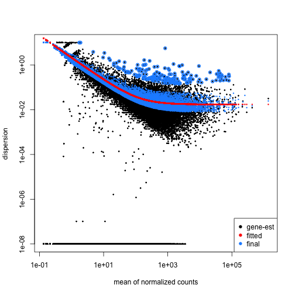
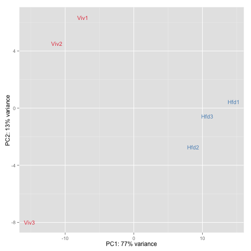
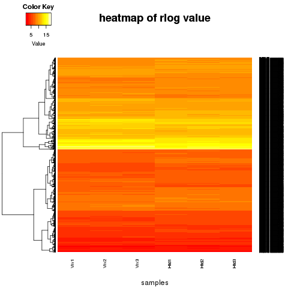
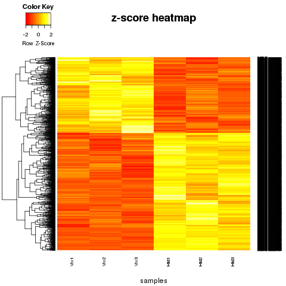
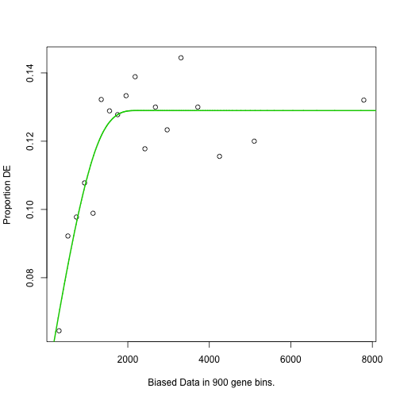

RNASeq Practical
========================================================
author:MRC CSC Bioinformatics Core
date:[http://bioinformatics.csc.mrc.ac.uk/training.html]
width: 1440
height: 1100
autosize: true
font-import: <link href='http://fonts.googleapis.com/css?family=Slabo+27px' rel='stylesheet' type='text/css'>
font-family: 'Slabo 27px', serif;
css:style.css


RNA-seq Introduction 
========================================================

RNA Sequencing (**RNA-seq**) is a well established technique which allows for studying expression profiles of thousands of genes/transcripts simultaneously. 


* Nature Reviews Genetics 10, 57-63 (January 2009)

RNA-seq introduction (continued)
========================================================
In this course we will use R packages available from the [Bioconductor project](https://www.bioconductor.org/).

We will cover differential expression analysis starting with a count table using single and multiple factor analysis, exploring results and interpreting lists of differentially expressed genes. 

For more details on quality control, read alignment and read counting you can join us on our [extended course](https://github.com/sanjaykhadayate/rnacourse/blob/master/practical.md).


Contents
====================================
* [Quality Assessment](#/quality).
* [Read alignment](#/alignment).
* [Read counting](#/counting).
* [Differential gene expression analysis](#/de).
* [Exploring and saving results](#/explore).
* [Gene ontology and pathway enrichment analysis](#/go).

Quality Assessment
========================================================
id: quality

Quality assessment can be performed at various levels such as raw reads, aligned data.

Basic checks on the raw data include checking sequence quality, GC content, adaptor contamination,
duplication levels etc. 

Bioconductor packages such as Rsubreads, EDAseq provides functions to retrieve and visualize 
various quality metrics.


Detailed information can be found [here](https://github.com/sanjaykhadayate/rnacourse/blob/master/practical.md).


Read Alignment
========================================================
id: alignment

First step in RNA-Seq data analysis is to align the raw reads to genome/transcriptome. 

For RNASeq data alignment, aligner need to be able to align across the exon-exon junction.

There are many tools that perform splice aware alignment of rnaseq data
such as Tophat, Rsubreads etc.

Output of this step is aligned data in [SAM/BAM format](http://mrccsc.github.io/genomicFormats.html#/11).  

 More information about [alignment](https://github.com/sanjaykhadayate/rnacourse/blob/master/practical.md).


Read Counting
========================================================
id: counting


After alignment, next step is to assign reads to features such as genes, transcripts
or exons. Many tools exists such as htseq or rsubreads.

Output of this step is a count table with reads assigned to individual features. 
This is usually called as raw counts and is input for many tools that perform the
differential expression analysis. 


More info about [Read counting](https://github.com/sanjaykhadayate/rnacourse/blob/master/practical.md).


Material
====================================
Dataset
* [GSE68360] (http://www.ncbi.nlm.nih.gov/geo/query/acc.cgi?acc=GSE68360)

We have generated the following files for this session

- "target" file that contain the sample information.

targets.txt

- "count" matrix  containing count table

AllCounts.csv


Analysis Parameters
========================================================

Define analysis parameters


```r
genome<-"mm9" 
strandspecific<-0 
factor1<-"Group"
isPairedEnd<-TRUE
```

Set working directory
========================================================

Before running any of the code, we need to set the working directory to the folder we unarchived. 
You may navigate to the unarchived short_RNAseq4review folder in the Rstudio menu

**Session -> Set Working Directory -> Choose Directory**

or in the console.


```r
# use the getwd() to see where your current directory is
# use setwd() to set up your directory in the console
setwd("/PathToMyDownload/short_RNAseq4review")
# e.g. setwd("~/Downloads/short_RNAseq4review")
```


Read sample data
========================================================
id: de

Read in "targets.txt" file by using read.table function


```r
targets <- read.table("targets.txt",sep="\t",header=TRUE)  
```

========================================================

```r
targets
```

```
  Sample Group Batch        InputFile       InputFile2 OutputFile
1   Viv1   Viv     a SRR2001243.fastq SRR2001244.fastq   Viv1.bam
2   Viv2   Viv     b SRR2001245.fastq SRR2001246.fastq   Viv2.bam
3   Viv3   Viv     c SRR2001247.fastq SRR2001248.fastq   Viv3.bam
4   Hfd1   Hfd     a SRR2001249.fastq SRR2001250.fastq   Hfd1.bam
5   Hfd2   Hfd     b SRR2001251.fastq SRR2001252.fastq   Hfd2.bam
6   Hfd3   Hfd     c SRR2001253.fastq SRR2001254.fastq   Hfd3.bam
```

Read count data
========================================================

Load count data by using read.csv function


```r
AllCounts<-read.csv(file="AllCounts.csv")
```

Read count data (Continued)
========================================================

```r
# show first few rows of "AllCounts" object

head(AllCounts)
```

```
                   X Viv1 Viv2 Viv3 Hfd1 Hfd2 Hfd3
1 ENSMUSG00000090025    0    0    0    0    0    0
2 ENSMUSG00000064842    0    0    0    0    0    0
3 ENSMUSG00000051951    0    1    1    3    0    0
4 ENSMUSG00000089699    0    0    0    0    0    0
5 ENSMUSG00000088390    0    0    0    0    0    0
6 ENSMUSG00000089420    0    0    0    0    0    0
```

```r
# show the class of AllCounts object

class(AllCounts)
```

```
[1] "data.frame"
```

Prepare deseqdataset object
========================================================

(1) Prepare the count matrix


```r
# Assign Gene_IDs to the rownames
  rownames(AllCounts)<-AllCounts[,1]

# Remove the Gene_IDs from AllCounts object
  AllCounts<-AllCounts[,-1]
  head(AllCounts)
```

```
                   Viv1 Viv2 Viv3 Hfd1 Hfd2 Hfd3
ENSMUSG00000090025    0    0    0    0    0    0
ENSMUSG00000064842    0    0    0    0    0    0
ENSMUSG00000051951    0    1    1    3    0    0
ENSMUSG00000089699    0    0    0    0    0    0
ENSMUSG00000088390    0    0    0    0    0    0
ENSMUSG00000089420    0    0    0    0    0    0
```

```r
# now you can change "AllCounts" object to "matrix" class
  AllCounts<-as.matrix(AllCounts)
  class(AllCounts)
```

```
[1] "matrix"
```

Prepare deseqdataset object (Continued)
========================================================

```r
# Remove genes counted as "0" in all samples

dim(AllCounts)
```

```
[1] 37991     6
```

```r
AllCountsKeep<-AllCounts[rowSums(AllCounts)>0,]
dim(AllCountsKeep)
```

```
[1] 22605     6
```

Prepare deseqdataset object (Continued)
========================================================

 (2) Collect sample information


```r
cData<-data.frame(name=targets$Sample,                                                                                                      Group=targets$Group,Batch=targets$Batch)

rownames(cData)<-cData[,1]

cData$Group
```

```
[1] Viv Viv Viv Hfd Hfd Hfd
Levels: Hfd Viv
```

```r
cData$Group<-relevel(cData$Group,ref="Viv")
```

========================================================


```r
 cData
```

```
     name Group Batch
Viv1 Viv1   Viv     a
Viv2 Viv2   Viv     b
Viv3 Viv3   Viv     c
Hfd1 Hfd1   Hfd     a
Hfd2 Hfd2   Hfd     b
Hfd3 Hfd3   Hfd     c
```

Prepare deseqdataset object (Continued)
========================================================

(3) construct deseqdataset object

The class used by the DESeq2 package to store the read counts is **DESeqDataSet**


```r
 library(DESeq2)

dds<-DESeqDataSetFromMatrix(
    countData= AllCountsKeep,colData=cData,
    design=~Group)
```

Differential expression analysis
========================================================

The standard differential expression analysis steps are wrapped into a single function, **DESeq**,
which performs normalization, fitting to the model and statistical testing.


```r
dds<-DESeq(dds)
```

DESeq function - estimateSizeFactors()
========================================================
The function DESeq runs the following functions in order


**Estimation of size factors**

The sizeFactors vector assigns to each column of the count matrix a value, the size factor, such that  count  values  in  the  columns  can  be  brought  to  a  common  scale  by  dividing  by  the  corresponding size factor.


```r
#  estimateSizeFactors()

sizeFactors(dds)
```

```
     Viv1      Viv2      Viv3      Hfd1      Hfd2      Hfd3 
1.2430187 0.7755226 1.0501449 0.9457439 1.0124687 1.0515602 
```

DESeq function - estimateDispersions()
========================================================

**Estimation of dispersion**

This function obtains dispersion estimates for Negative Binomial distributed data.


```r
#  estimateDispersions()

head(dispersions(dds))
```

```
[1] 2.38131503 0.07089983 1.74258431 0.01058958 0.01366013 0.01214638
```

```r
plotDispEsts(dds)
```

 

DESeq function - nbinomWaldTest()
========================================================
**Negative Binomial GLM fitting and Wald statistics**

This function tests for significance of coefficients in a Negative Binomial GLM, using previously calculated sizeFactors (or normalizationFactors ) and dispersion estimates.


```r
#  nbinomWaldTest()
```


Getting results
========================================================

Results tables are generated using the function **results()**, which extracts a results table with log2 fold changes, p  values and adjusted p values.

```r
# use the function "results()"
res<-results(dds) 

# Order results by adjusted p value 
resOrdered<-res[order(res$padj),]
```

Getting results
========================================================


```r
head(resOrdered)
```

```
log2 fold change (MAP): Group Hfd vs Viv 
Wald test p-value: Group Hfd vs Viv 
DataFrame with 6 rows and 6 columns
                     baseMean log2FoldChange     lfcSE      stat
                    <numeric>      <numeric> <numeric> <numeric>
ENSMUSG00000024526   465.8790       5.870472 0.2487112  23.60356
ENSMUSG00000032080 14291.8178       4.534206 0.2277755  19.90647
ENSMUSG00000026475  3141.2571       4.428017 0.2530798  17.49652
ENSMUSG00000069170   343.9283       3.649988 0.2239693  16.29682
ENSMUSG00000042041   651.0023       2.973281 0.1893514  15.70245
ENSMUSG00000034634   199.3508       4.356157 0.2806007  15.52440
                          pvalue          padj
                       <numeric>     <numeric>
ENSMUSG00000024526 3.542564e-123 6.138200e-119
ENSMUSG00000032080  3.576261e-88  3.098294e-84
ENSMUSG00000026475  1.522841e-68  8.795424e-65
ENSMUSG00000069170  1.039555e-59  4.503090e-56
ENSMUSG00000042041  1.455116e-55  5.042560e-52
ENSMUSG00000034634  2.372207e-54  6.850538e-51
```

Add Gene symbol
========================================================


```r
# Add Gene Symbols

library(biomaRt)

mart=useMart('ENSEMBL_MART_ENSEMBL',
dataset='mmusculus_gene_ensembl',
host="may2012.archive.ensembl.org")

testgetbm<-getBM(attributes=c('ensembl_gene_id',                                                                                         'mgi_symbol'),
filters ='ensembl_gene_id',
values=rownames(resOrdered), mart=mart)

# see the first few rows of "testgetbm" object
head(testgetbm)      
```

```
     ensembl_gene_id mgi_symbol
1 ENSMUSG00000085299    Gm16627
2 ENSMUSG00000020530     Ggnbp2
3 ENSMUSG00000048534     Amica1
4 ENSMUSG00000086875     Gm8975
5 ENSMUSG00000083149    Gm11380
6 ENSMUSG00000049721    Gal3st1
```

Add Gene symbol (Continued)
========================================================


```r
# merge the Gene_symbol to our DE dataset
Allinfo <- merge(as.data.frame(resOrdered),testgetbm,by.x=0,by.y=1)
head(Allinfo)
```

```
           Row.names     baseMean log2FoldChange     lfcSE        stat
1 ENSMUSG00000000001 2.438865e+03    0.009921221 0.1100282  0.09016981
2 ENSMUSG00000000028 3.803191e+01    0.219529071 0.2996414  0.73263936
3 ENSMUSG00000000031 1.419411e+01    1.679842604 0.3670980  4.57600535
4 ENSMUSG00000000037 4.993369e-01    0.236764636 0.2031768  1.16531306
5 ENSMUSG00000000049 3.907640e+04   -0.107570380 0.1356914 -0.79275763
6 ENSMUSG00000000056 8.366359e+02   -0.226361527 0.1902316 -1.18992612
        pvalue         padj mgi_symbol
1 9.281523e-01 0.9777163748      Gnai3
2 4.637784e-01 0.7740958171      Cdc45
3 4.739384e-06 0.0001359591        H19
4 2.438923e-01           NA      Scml2
5 4.279190e-01 0.7499942096       Apoh
6 2.340754e-01 0.5742776554       Narf
```

```r
# change the column name
colnames(Allinfo)[1]<-"ensembl_gene_id"
```
Add Gene symbol (Continued)
========================================================


```r
# Order results by adjusted p value
Allinfo<-Allinfo[order(Allinfo$pvalue,                                                                                                   decreasing=F),]

# show the result with gene symbol annotation
head(Allinfo)
```

```
         ensembl_gene_id   baseMean log2FoldChange     lfcSE     stat
4101  ENSMUSG00000024526   465.8790       5.870472 0.2487112 23.60356
7849  ENSMUSG00000032080 14291.8178       4.534206 0.2277755 19.90647
5019  ENSMUSG00000026475  3141.2571       4.428017 0.2530798 17.49652
15734 ENSMUSG00000069170   343.9283       3.649988 0.2239693 16.29682
11093 ENSMUSG00000042041   651.0023       2.973281 0.1893514 15.70245
8725  ENSMUSG00000034634   199.3508       4.356157 0.2806007 15.52440
             pvalue          padj    mgi_symbol
4101  3.542564e-123 6.138200e-119         Cidea
7849   3.576261e-88  3.098294e-84         Apoa4
5019   1.522841e-68  8.795424e-65         Rgs16
15734  1.039555e-59  4.503090e-56         Gpr98
11093  1.455116e-55  5.042560e-52 2010003K11Rik
8725   2.372207e-54  6.850538e-51          Ly6d
```

Saving DEseq2 results
========================================================

Save the result in ".txt" or ".csv" format


```r
write.table(Allinfo,file="DESeq_result.txt",                                                                                                  sep="\t")
write.csv(Allinfo,file="DESeq_result.csv",                                                                                                    row.names=F)
```
Exploring results
========================================================


```r
summary(res)
```

```

out of 22605 with nonzero total read count
adjusted p-value < 0.1
LFC > 0 (up)     : 1474, 6.5% 
LFC < 0 (down)   : 980, 4.3% 
outliers [1]     : 19, 0.084% 
low counts [2]   : 5259, 23% 
(mean count < 2)
[1] see 'cooksCutoff' argument of ?results
[2] see 'independentFiltering' argument of ?results
```

```r
# How many adjusted p-values were less than 0.05?
sum(res$padj < 0.05, na.rm=TRUE)
```

```
[1] 1981
```

Exploring results
========================================================


```r
 # Another way to get the results
    res_contrast<-results(dds,                                                                                                           contrast=c("Group","Hfd","Viv")) 

 # the result should same as "res"
    
    summary(res_contrast)
```

```

out of 22605 with nonzero total read count
adjusted p-value < 0.1
LFC > 0 (up)     : 1474, 6.5% 
LFC < 0 (down)   : 980, 4.3% 
outliers [1]     : 19, 0.084% 
low counts [2]   : 5259, 23% 
(mean count < 2)
[1] see 'cooksCutoff' argument of ?results
[2] see 'independentFiltering' argument of ?results
```


Transformation of count data
========================================================
id: explore

The function **rlog** (regularized log), transforms the original count data to the log2 scale.

Aim of this transformation,  the rlog,  is  to  remove  the  dependence  of  the  variance on  the  mean,  so that data is suitable for visualization. 
Particularly  the  high  variance  of  the  logarithm  of  count  data  when  the  mean  is  low. 

```r
rld<-rlog(dds)  
```

Transformation of count data
========================================================


Principal component analysis of the samples (version1)
========================================================

**PCA plot** is useful to spot individual sample outliers. 


```r
plotPCA(rld, intgroup="Group")
```

 

```r
# save the plot

library(ggplot2)
ggsave(file="PCA_plot_version1.png")
```

Principal component plot of the samples (version2)
========================================================


```r
library(RColorBrewer)
showcols <- brewer.pal(8, "Set1")[1:length(unique(colData(dds)$Group))]

data <- plotPCA(rld, intgroup="Group", returnData=TRUE)
percentVar <- round(100 * attr(data, "percentVar"))
```

  attr function gets the named attribute of an object.
  Here, gets the percent variation from data object.


PCA of the samples (version2-Contin'd)
========================================================


```r
ggplot(data, aes(PC1, PC2,label=colData(dds)$name))+
  geom_text(col=showcols[colData(dds)$Group],                                                                                                alpha=0.8,size=4)+
  xlab(paste0("PC1: ",percentVar[1],"% variance")) +
  ylab(paste0("PC2: ",percentVar[2],"% variance"))
```

 

```r
ggsave(file="PCA_plot_version2.png")
```

Heatmap of sample to sample distances
========================================================

Another use of the transformed data is sample clustering. Here, we apply the dist function to the transpose
of the transformed count matrix to get sample-to-sample distances. 

The assay function is used to extract the matrix of normalized values


```r
rlogcount <- assay(rld)      
rlogcount <- rlogcount[!rowSums(rlogcount) == 0,]
sampleDists <- as.matrix(dist(t(rlogcount)))
```

========================================================

 Save the plot as png file


```r
png(file="sample_dis_map.png")
  heatmap.2(as.matrix(sampleDists), key=F, trace="none",
    col=colorpanel(100, "black", "white"),
    ColSideColors=showcols[colData(dds)$Group], 
    RowSideColors=showcols[colData(dds)$Group],
    margin=c(10, 10), main="Sample Distance Matrix")
dev.off()
```


=======================================================


Exploring results - MA plot
========================================================
The  function **plotMA()** shows  the  log2  fold  changes  attributable  to  a  given  variable  over  the  mean of normalized counts.  Points will be colored red if the adjusted p value is less than 0.1.  Points which fall out of the window are plotted as open triangles pointing either up or down.


```r
plotMA(res, main="DESeq2", ylim=c(-4,4))
```

 

Exploring results - Plot counts
========================================================
 **Plot of normalized counts for a single gene on log scale**


```r
plotCounts(dds,gene=which.min(res$padj),                                                                                                 intgroup="Group")
```

 


Heatmap of the count matrix
========================================================

To explore a counts matrix, it is often useful to look it as heatmap.


```r
# generate DE gene list
  DEgenes4heatmap<-res[res$padj<0.05 & !is.na(res$padj),]
# show the number of DE genes
  nrow(DEgenes4heatmap)
```

```
[1] 1981
```

```r
# retrieve rlog values for DE genes
  rlog4heatmap<-rlogcount[rownames(rlogcount) %in% rownames(DEgenes4heatmap),]
  dim(rlog4heatmap)
```

```
[1] 1981    6
```

Heatmap of the count matrix
========================================================


```r
head(rlog4heatmap)
```

```
                        Viv1      Viv2      Viv3      Hfd1      Hfd2
ENSMUSG00000033845 10.092307 10.155323 10.030216  9.831824  9.845323
ENSMUSG00000048538 12.974461 13.080011 13.062474 12.288298 12.403851
ENSMUSG00000025911 11.302830 11.202134 11.340166 11.108043 10.976273
ENSMUSG00000067879  2.078910  2.102381  2.086837  2.258972  2.290082
ENSMUSG00000025912  4.221734  4.247558  4.133075  4.719980  4.582148
ENSMUSG00000056763  8.069013  8.068498  8.195346  7.822268  7.880445
                        Hfd3
ENSMUSG00000033845  9.840293
ENSMUSG00000048538 12.473197
ENSMUSG00000025911 11.004958
ENSMUSG00000067879  2.222014
ENSMUSG00000025912  4.552238
ENSMUSG00000056763  7.846657
```

Heatmap of the count matrix
========================================================


```r
png(file="heatmap1.png")
  testla1<-heatmap.2(rlog4heatmap, Rowv=T, 
      Colv=F, dendrogram="row", cexCol=0.75,cexRow=0.35, 
      keysize=1, cex.main=0.5,symkey=FALSE, trace="none", 
      density.info="none", xlab="samples",
      main="heatmap of rlog value")
dev.off()
```

=======================================================



Heatmap of the count matrix
========================================================


```r
scaled_matrix<-t(scale(t(rlog4heatmap)))
show_distance_scale<-dist(scaled_matrix, method="euclidean")
show_cluster_scaled<- hclust(show_distance_scale, method="complete")

png(file="heatmap2.png")
  testla2<-heatmap.2(rlog4heatmap, Rowv=as.dendrogram(show_cluster_scaled), 
      Colv=F, scale="row", dendrogram="row", cexCol=0.75,cexRow=0.35, 
      keysize=1, cex.main=0.5,symkey=FALSE, trace="none", 
      density.info="none", xlab="samples",
      main="z-score heatmap")
dev.off()
```

=======================================================




Multi factor designs
========================================================
Experiments  with  more  than  one  factor  influencing  the  counts  can  be  analyzed  using  design  formula  that  include  the  additional  variables. 

```r
targets
```

```
  Sample Group Batch        InputFile       InputFile2 OutputFile
1   Viv1   Viv     a SRR2001243.fastq SRR2001244.fastq   Viv1.bam
2   Viv2   Viv     b SRR2001245.fastq SRR2001246.fastq   Viv2.bam
3   Viv3   Viv     c SRR2001247.fastq SRR2001248.fastq   Viv3.bam
4   Hfd1   Hfd     a SRR2001249.fastq SRR2001250.fastq   Hfd1.bam
5   Hfd2   Hfd     b SRR2001251.fastq SRR2001252.fastq   Hfd2.bam
6   Hfd3   Hfd     c SRR2001253.fastq SRR2001254.fastq   Hfd3.bam
```


========================================================


```r
ddsMF<-DESeqDataSetFromMatrix(countData= AllCountsKeep,colData= cData,design=~ Batch + Group)
      
ddsMF <- DESeq(ddsMF)

resMF <- results(ddsMF)
```


========================================================


```r
resMForder<-resMF[order(resMF$padj),]
head(resMForder)
```

```
log2 fold change (MAP): Group Hfd vs Viv 
Wald test p-value: Group Hfd vs Viv 
DataFrame with 6 rows and 6 columns
                     baseMean log2FoldChange     lfcSE      stat
                    <numeric>      <numeric> <numeric> <numeric>
ENSMUSG00000024526   465.8790       5.639844 0.2679233  21.05022
ENSMUSG00000069170   343.9283       3.663476 0.2093866  17.49623
ENSMUSG00000042041   651.0023       3.018988 0.1745086  17.29994
ENSMUSG00000067225  6670.8727      -2.885727 0.1689429 -17.08108
ENSMUSG00000073830 38186.8715      -3.199105 0.1915369 -16.70229
ENSMUSG00000042248  9297.1517      -2.505798 0.1524572 -16.43608
                         pvalue         padj
                      <numeric>    <numeric>
ENSMUSG00000024526 2.276149e-98 3.648895e-94
ENSMUSG00000069170 1.530744e-68 1.226968e-64
ENSMUSG00000042041 4.708815e-67 2.516234e-63
ENSMUSG00000067225 2.052820e-65 8.227190e-62
ENSMUSG00000073830 1.261277e-62 4.043906e-59
ENSMUSG00000042248 1.055271e-60 2.819508e-57
```


========================================================


```r
summary(resMForder)
```

```

out of 22605 with nonzero total read count
adjusted p-value < 0.1
LFC > 0 (up)     : 1165, 5.2% 
LFC < 0 (down)   : 837, 3.7% 
outliers [1]     : 0, 0% 
low counts [2]   : 6574, 29% 
(mean count < 5)
[1] see 'cooksCutoff' argument of ?results
[2] see 'independentFiltering' argument of ?results
```


Likelihood Ratio Test
========================================================

DESeq2 offers  two  kinds  of  hypothesis  tests: 
  
  1. **Wald  test**
  
  We  use  the  estimated  standard  error  of a  log2  fold  change  to  test  if  it  is  equal  to  zero.

  2. **Likelihood  ratio  test  (LRT)**
  
  The  LRT  examines  two models  for  the  counts,  a full model  with  a  certain  number  of  terms  and  a
reduced model,  in  which  some  of the terms of the full model are removed.  
The test determines if the increased likelihood of the data using the extra terms in the full model is more than expected if those extra terms are truly zero.

Likelihood Ratio Test (Continued)
========================================================

The **LRT** is therefore useful for testing multiple terms at once, for example testing 3 or more levels of a factor
at once, or all interactions between two variables.

The likelihood ratio test can be specified using the test argument to DESeq , which substitutes
nbinomWaldTest with nbinomLRT.  

In  this  case,  the  user  needs  to  provide  a  reduced  formula,  e.g.   one  in  which  a  number  of terms  from design(dds) are  removed.  


DESeq using LRT
========================================================


```r
ddsLRT<-DESeqDataSetFromMatrix(countData= AllCountsKeep,colData= cData,design=~ Batch + Group)

# We would like to see the Group effect hence the reduced=~Batch     
ddsLRT <- DESeq(ddsLRT, test="LRT", 
                full=~Batch+ Group, 
                reduced=~Batch)

resLRT<-results(ddsLRT)

resLRTorder<-resLRT[order(resLRT$padj),]
```

========================================================


```r
head(resLRTorder)
```

```
log2 fold change (MLE): Group Hfd vs Viv 
LRT p-value: '~ Batch + Group' vs '~ Batch' 
DataFrame with 6 rows and 6 columns
                     baseMean log2FoldChange     lfcSE      stat
                    <numeric>      <numeric> <numeric> <numeric>
ENSMUSG00000024526   465.8790       6.890091 0.3788647  391.6319
ENSMUSG00000069170   343.9283       4.009142 0.2344582  278.3676
ENSMUSG00000042041   651.0023       3.214898 0.1864870  269.7341
ENSMUSG00000067225  6670.8727      -3.058591 0.1786554  249.6026
ENSMUSG00000042248  9297.1517      -2.619363 0.1594119  239.0402
ENSMUSG00000078686 40949.7670      -2.818665 0.1711790  234.6732
                         pvalue         padj
                      <numeric>    <numeric>
ENSMUSG00000024526 3.652753e-87 6.015719e-83
ENSMUSG00000069170 1.703478e-62 1.402729e-58
ENSMUSG00000042041 1.296794e-60 7.118965e-57
ENSMUSG00000067225 3.170087e-56 1.305204e-52
ENSMUSG00000042248 6.367707e-54 2.097395e-50
ENSMUSG00000078686 5.704704e-53 1.565846e-49
```

========================================================


```r
summary(resLRTorder)
```

```

out of 22605 with nonzero total read count
adjusted p-value < 0.1
LFC > 0 (up)     : 1149, 5.1% 
LFC < 0 (down)   : 816, 3.6% 
outliers [1]     : 0, 0% 
low counts [2]   : 6136, 27% 
(mean count < 4)
[1] see 'cooksCutoff' argument of ?results
[2] see 'independentFiltering' argument of ?results
```


Gene Ontology and Pathway Enrichment Analysis
========================================================
id: go

We will perform GO analysis using goseq package.

 In order to perform a GO analysis of your RNA-seq data,goseq only requires a simple named vector, which contains two pieces of information.

1 **Measured genes**
   
 all genes for which RNA-seq data was gathered for your experiment.  Each element of your vector should be named by a unique gene identifier.

2 **Differentially expressed genes**
   
 each element of your vector should be either a 1 or 0, where 1 indicates that the gene is differentially expressed and 0 that it is not.


========================================================


```r
library(KEGG.db)
library(goseq)

# remove the NAs

resdat<- res[complete.cases(res$padj),]
 
degenes<-as.integer(resdat$padj<0.05)
names(degenes)<-rownames(resdat)
    
# remove duplicate gene names
degenes<-degenes[match(unique(names(degenes)),                                                                                              names(degenes))]

table(degenes)
```

```
degenes
    0     1 
15346  1981 
```


========================================================

**Fitting the probability weighting function (PWF)**

We first need to obtain a weighting for each gene, 
depending on its length, given by the PWF


```r
pwf=nullp(degenes,genome,'ensGene',                                                                                                          plot.fit=FALSE)
```

========================================================


```r
  head(pwf)
```

```
                   DEgenes bias.data        pwf
ENSMUSG00000025902       0    3190.5 0.12898011
ENSMUSG00000033845       1     830.0 0.10097541
ENSMUSG00000025903       0     938.0 0.10638814
ENSMUSG00000033813       0    2565.0 0.12898011
ENSMUSG00000062588       0     604.0 0.08819574
ENSMUSG00000033793       0    1907.0 0.12861934
```

========================================================


```r
   plotPWF(pwf)
```

 

========================================================

Change the Keggpath id to name in the goseq output


```r
xx <- as.list(KEGGPATHID2NAME)
temp <- cbind(names(xx),unlist(xx))
    
addKeggTogoseq <- function(JX,temp){
  for(l in 1:nrow(JX)){
      if(JX[l,1] %in% temp[,1]){
          JX[l,"term"] <- temp[temp[,1] %in% JX[l,1],2]
          JX[l,"ontology"] <- "KEGG"
      }
  }
  return(JX)
}
```

========================================================

 Calculate  the  over  and  under  expressed  GO
categories among DE genes


```r
go<-goseq(pwf,genome,'ensGene',                                                                                                              test.cats=c("GO:BP","GO:MF","KEGG"))
```

========================================================

```r
head(go)
```

```
       category over_represented_pvalue under_represented_pvalue
2776 GO:0007155            1.371565e-19                        1
5327 GO:0022610            1.371565e-19                        1
86        01100            2.427605e-17                        1
6116 GO:0032501            5.302956e-17                        1
83        00982            1.239686e-16                        1
2171 GO:0006082            1.276600e-15                        1
     numDEInCat numInCat                             term ontology
2776        128      448                    cell adhesion       BP
5327        128      448              biological adhesion       BP
86          217     1018                             <NA>     <NA>
6116        433     2413 multicellular organismal process       BP
83           40       79                             <NA>     <NA>
2171        125      487   organic acid metabolic process       BP
```

========================================================

```r
restemp<-addKeggTogoseq(go,temp)   

head(restemp)
```

```
       category over_represented_pvalue under_represented_pvalue
2776 GO:0007155            1.371565e-19                        1
5327 GO:0022610            1.371565e-19                        1
86        01100            2.427605e-17                        1
6116 GO:0032501            5.302956e-17                        1
83        00982            1.239686e-16                        1
2171 GO:0006082            1.276600e-15                        1
     numDEInCat numInCat                              term ontology
2776        128      448                     cell adhesion       BP
5327        128      448               biological adhesion       BP
86          217     1018                Metabolic pathways     KEGG
6116        433     2413  multicellular organismal process       BP
83           40       79 Drug metabolism - cytochrome P450     KEGG
2171        125      487    organic acid metabolic process       BP
```


========================================================

```r
write.table(restemp,file="GO_Kegg_Wallenius.txt", row.names=F,sep="\t")

write.csv(restemp,file="GO_Kegg_Wallenius.csv", row.names=F)
```

Session Information
========================================================

```r
    sessionInfo()
```

```
R version 3.2.2 (2015-08-14)
Platform: x86_64-apple-darwin13.4.0 (64-bit)
Running under: OS X 10.10.5 (Yosemite)

locale:
[1] en_GB.UTF-8/en_GB.UTF-8/en_GB.UTF-8/C/en_GB.UTF-8/en_GB.UTF-8

attached base packages:
[1] parallel  stats4    stats     graphics  grDevices utils     datasets 
[8] methods   base     

other attached packages:
 [1] biomaRt_2.26.1             gplots_2.17.0             
 [3] org.Mm.eg.db_2.4.6         KEGG.db_2.4.5             
 [5] AnnotationDbi_1.32.2       ggplot2_1.0.1             
 [7] RColorBrewer_1.1-2         goseq_1.22.0              
 [9] RSQLite_1.0.0              DBI_0.3.1                 
[11] geneLenDataBase_1.6.0      BiasedUrn_1.06.1          
[13] DESeq2_1.10.0              RcppArmadillo_0.6.300.2.0 
[15] Rcpp_0.12.2                SummarizedExperiment_1.0.1
[17] Biobase_2.30.0             GenomicRanges_1.22.1      
[19] GenomeInfoDb_1.6.1         IRanges_2.4.5             
[21] S4Vectors_0.8.4            BiocGenerics_0.16.1       
[23] edgeR_3.12.0               limma_3.26.5              
[25] knitr_1.11                

loaded via a namespace (and not attached):
 [1] splines_3.2.2           gtools_3.5.0           
 [3] Formula_1.2-1           latticeExtra_0.6-26    
 [5] Rsamtools_1.22.0        lattice_0.20-33        
 [7] digest_0.6.8            XVector_0.10.0         
 [9] colorspace_1.2-6        Matrix_1.2-3           
[11] plyr_1.8.3              XML_3.98-1.3           
[13] genefilter_1.52.0       zlibbioc_1.16.0        
[15] xtable_1.8-0            GO.db_3.2.2            
[17] scales_0.3.0            gdata_2.17.0           
[19] BiocParallel_1.4.0      annotate_1.48.0        
[21] mgcv_1.8-9              GenomicFeatures_1.22.6 
[23] nnet_7.3-11             proto_0.3-10           
[25] survival_2.38-3         magrittr_1.5           
[27] evaluate_0.8            nlme_3.1-122           
[29] MASS_7.3-45             foreign_0.8-66         
[31] tools_3.2.2             formatR_1.2.1          
[33] stringr_1.0.0           munsell_0.4.2          
[35] locfit_1.5-9.1          cluster_2.0.3          
[37] lambda.r_1.1.7          Biostrings_2.38.2      
[39] caTools_1.17.1          futile.logger_1.4.1    
[41] grid_3.2.2              RCurl_1.95-4.7         
[43] labeling_0.3            bitops_1.0-6           
[45] codetools_0.2-14        gtable_0.1.2           
[47] reshape2_1.4.1          GenomicAlignments_1.6.1
[49] gridExtra_2.0.0         rtracklayer_1.30.1     
[51] Hmisc_3.17-0            futile.options_1.0.0   
[53] KernSmooth_2.23-15      stringi_1.0-1          
[55] geneplotter_1.48.0      rpart_4.1-10           
[57] acepack_1.3-3.3        
```
Time for Exercises!
=========================================================

* [RNAseq Exercises](Exercise_ShortRNAseq_questions.html)

Time for Solutions?
=========================================================

* [RNAseq Solutions](Exercise_ShortRNAseq_Solutions.html)
