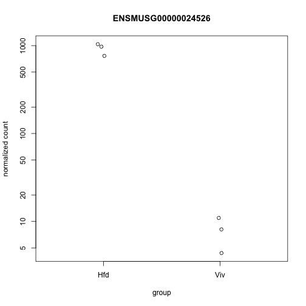

Analysis of RNAseq data
========================================================
author:MRC CSC Bioinformatics Core
date:[http://mrccsc.github.io/RNAseq_short/]
width: 1440
height: 1100
autosize: true
font-import: <link href='http://fonts.googleapis.com/css?family=Slabo+27px' rel='stylesheet' type='text/css'>
font-family: 'Slabo 27px', serif;
css:style.css


RNA-seq Introduction 
========================================================

RNA Sequencing (**RNA-seq**) is a well established technique which allows for studying expression profiles of thousands of genes/transcripts simultaneously. 

<div align="center">

</div>

* Nature Reviews Genetics 10, 57-63 (January 2009)


Contents
====================================
* [Quality Assessment](#/quality).
* [Read alignment](#/alignment).
* [Read counting](#/counting).
* [Differential gene expression analysis](#/de).
* [Exploring and saving results](#/explore).
* [Gene ontology and pathway enrichment analysis](#/go).


Analysis Considerations
========================================================

* Single end or Paired end sequencing experiment?
* Strand specific or non stand specific
* How many factors involved in experiment (genotype, treatment, time course etc.)
* What genome is involved?
* Is it a well annotated organism or a poorly annotated one. 

========================================================

<div align="center">

</div>

Set working directory
========================================================

Before running any of the code, we need to set the working directory to the folder we unarchived. 
You may navigate to the unarchived RNAseq_short/course folder in the Rstudio menu

**Session -> Set Working Directory -> Choose Directory**

or in the console, 

Use the getwd() to see where your current directory is


```r
getwd()
```

Use setwd() to set up your directory in the console


```r
setwd("/PathToMyDownload/RNAseq_short/course")
```


Quality Assessment
========================================================
id: quality

Quality assessment can be performed at various levels such as raw reads, aligned data, count data.

Basic checks on the raw data include checking sequence quality, GC content, adaptor contamination,
duplication levels etc. 

Bioconductor packages such as Rsubreads, EDAseq, ShortRead provides functions to retrieve and visualize 
various quality metrics.


Detailed information can be found [here](https://mrccsc.github.io/Alignment/course/Alignment.html#/13).


Read Alignment
========================================================
id: alignment

First step in RNA-Seq data analysis is to align the raw reads to genome/transcriptome. 

For RNASeq data alignment, aligner need to be able to align across the exon-exon junction.

There are many tools that perform splice aware alignment of rnaseq data
such as Tophat, Rsubreads etc. One can also use SpliceMap function from Rbowtie package.

Output of this step is aligned data in [SAM/BAM format](http://mrccsc.github.io/genomicFormats.html#/11).  

 More information about [alignment](https://mrccsc.github.io/Alignment/course/Alignment.html#/32).


Read Counting
========================================================
id: counting


After alignment, next step is to assign reads to features such as genes, transcripts
or exons. Many tools exists such as htseq or rsubreads.

Output of this step is a count table with reads assigned to individual features. 
This is usually called as raw counts and is input for many tools that perform the
differential expression analysis. 

For counting aligned reads in genes, the summarizeOverlaps function
of GenomicAlignments with mode="Union" can be used, resulting in a RangedSummarizedExperiment
object.

More info about [Read counting](https://mrccsc.github.io/Alignment/course/Alignment.html#/54).


Material
====================================
Dataset
* [GSE68360] (http://www.ncbi.nlm.nih.gov/geo/query/acc.cgi?acc=GSE68360)

We have generated the following files for this session.

- **target** file that contain the sample information.

targets.txt

- **count** matrix  containing count table

AllCounts.csv


Read sample information
========================================================
id: de

Read in **targets.txt** file by using read.table function


```r
targets <- read.table("targets.txt",sep="\t",header=TRUE)  

targets
```

```
  Sample Group Batch        InputFile       InputFile2 OutputFile
1   Viv1   Viv     a SRR2001243.fastq SRR2001244.fastq   Viv1.bam
2   Viv2   Viv     b SRR2001245.fastq SRR2001246.fastq   Viv2.bam
3   Viv3   Viv     c SRR2001247.fastq SRR2001248.fastq   Viv3.bam
4   Hfd1   Hfd     a SRR2001249.fastq SRR2001250.fastq   Hfd1.bam
5   Hfd2   Hfd     b SRR2001251.fastq SRR2001252.fastq   Hfd2.bam
6   Hfd3   Hfd     c SRR2001253.fastq SRR2001254.fastq   Hfd3.bam
```

Read count data
========================================================

Load count data by using read.csv function


```r
AllCounts<-read.csv(file="AllCounts.csv",row.names = 1)
```

 Show first few rows of "AllCounts" object and the class of AllCounts object


```r
head(AllCounts)
```

```
                   Viv1 Viv2 Viv3 Hfd1 Hfd2 Hfd3
ENSMUSG00000090025    0    0    0    0    0    0
ENSMUSG00000064842    0    0    0    0    0    0
ENSMUSG00000051951    0    1    1    3    0    0
ENSMUSG00000089699    0    0    0    0    0    0
ENSMUSG00000088390    0    0    0    0    0    0
ENSMUSG00000089420    0    0    0    0    0    0
```

```r
class(AllCounts)
```

```
[1] "data.frame"
```


Prepare deseqdataset object 
========================================================

 Collect sample information


```r
cData<-data.frame(name=targets$Sample,                                                                          Group=targets$Group,Batch=targets$Batch)

rownames(cData)<-cData[,1]
```


Prepare deseqdataset object (Continued)
========================================================

 Construct deseqdataset object

The class used by the DESeq2 package to store the read counts is **DESeqDataSet**.


```r
 library(DESeq2)

dds<-DESeqDataSetFromMatrix(
    countData= AllCounts,colData=cData,
    design=~Group)
```

Differential expression analysis
========================================================

The standard differential expression analysis steps are wrapped into a single function, **DESeq**,
which performs normalization, fitting to the model and statistical testing.


```r
dds<-DESeq(dds)

?DESeq
```

The function DESeq runs the following functions in order,

**estimateSizeFactors()**

**estimateDispersions()**

**nbinomWaldTest()**


DESeq function - estimateSizeFactors()
========================================================


1 - **Estimation of size factors**

The sizeFactors vector assigns to each column of the count matrix a value, the size factor, such that  count  values  in  the  columns  can  be  brought  to  a  common  scale  by  dividing  by  the  corresponding size factor.


```r
#  estimateSizeFactors()

sizeFactors(dds)
```

```
     Viv1      Viv2      Viv3      Hfd1      Hfd2      Hfd3 
1.2430187 0.7755226 1.0501449 0.9457439 1.0124687 1.0515602 
```

========================================================

<div align="center">

</div>


DESeq function - estimateDispersions()
========================================================

2 - **Estimation of dispersion**

This function obtains gene-wide dispersion estimates. Then, a curve is fit to the estimates to capture the overall trend of dispersion-mean dependence. 


```r
#  estimateDispersions()

head(dispersions(dds))
```

```
[1]       NA       NA 2.471224       NA       NA       NA
```

```r
plotDispEsts(dds)
```


DESeq function - nbinomWaldTest()
========================================================
3- **Hypothesis test for differential expression**


For significance testing, DESeq2 by default uses a Wald test, where
the function tests whether each model coefficient differs significantly from zero, using previously calculated sizeFactors and dispersion estimates.

The Wald test P values  are adjusted for multiple testing using the procedure of Benjamini and Hochberg.


```r
nbinomWaldTest()
```


Getting results
========================================================

Results tables are generated using the function **results()**, which extracts a results table with log2 fold changes, p  values and adjusted p values.

 Use the function "results()"


```r
res<-results(dds) 
```

 Order results by adjusted p value


```r
resOrdered<-res[order(res$padj),]

?results      
```


Getting results
========================================================


```r
head(resOrdered)
```

```
log2 fold change (MAP): Group Viv vs Hfd 
Wald test p-value: Group Viv vs Hfd 
DataFrame with 6 rows and 6 columns
                     baseMean log2FoldChange     lfcSE      stat
                    <numeric>      <numeric> <numeric> <numeric>
ENSMUSG00000024526   465.8790      -5.863471 0.2482237 -23.62172
ENSMUSG00000032080 14291.8178      -4.528817 0.2277876 -19.88176
ENSMUSG00000026475  3141.2571      -4.420009 0.2531844 -17.45767
ENSMUSG00000069170   343.9283      -3.645414 0.2240519 -16.27040
ENSMUSG00000042041   651.0023      -2.971362 0.1892775 -15.69844
ENSMUSG00000034634   199.3508      -4.344026 0.2806835 -15.47660
                          pvalue          padj
                       <numeric>     <numeric>
ENSMUSG00000024526 2.305664e-123 3.941302e-119
ENSMUSG00000032080  5.854814e-88  5.004109e-84
ENSMUSG00000026475  3.009769e-68  1.714966e-64
ENSMUSG00000069170  1.601048e-59  6.842080e-56
ENSMUSG00000042041  1.550018e-55  5.299202e-52
ENSMUSG00000034634  4.991579e-54  1.422101e-50
```

Add Gene symbol
========================================================


```r
# Add Gene Symbols

library(biomaRt)

mart=useMart('ENSEMBL_MART_ENSEMBL',
dataset='mmusculus_gene_ensembl',
host="may2012.archive.ensembl.org")

bm<-getBM(attributes=c('ensembl_gene_id','mgi_symbol'),
filters ='ensembl_gene_id',
values=rownames(resOrdered), mart=mart)

# see the first few rows of "bm" object
head(bm)      
```

```
     ensembl_gene_id    mgi_symbol
1 ENSMUSG00000073519       Gm10524
2 ENSMUSG00000085190 4930445N18Rik
3 ENSMUSG00000085190 3010027C24Rik
4 ENSMUSG00000091488        Gm6225
5 ENSMUSG00000090484       Gm17417
6 ENSMUSG00000073646       Gm10556
```

Add Gene symbol (Continued)
========================================================


```r
# merge the Gene_symbol to our DE dataset
resAnnotated <- merge(as.data.frame(resOrdered),bm,by.x=0,by.y=1)
head(resAnnotated)
```

```
           Row.names     baseMean log2FoldChange     lfcSE        stat
1 ENSMUSG00000000001 2.438865e+03   -0.009915849 0.1088892 -0.09106364
2 ENSMUSG00000000003 0.000000e+00             NA        NA          NA
3 ENSMUSG00000000028 3.803191e+01   -0.218532198 0.3005797 -0.72703575
4 ENSMUSG00000000031 1.419411e+01   -1.661493799 0.3665356 -4.53296731
5 ENSMUSG00000000037 4.993369e-01   -0.197619794 0.1948394 -1.01427038
6 ENSMUSG00000000049 3.907640e+04    0.107573651 0.1350213  0.79671637
        pvalue         padj mgi_symbol
1 9.274420e-01 0.9768743543      Gnai3
2           NA           NA       Pbsn
3 4.672041e-01 0.7750466744      Cdc45
4 5.816082e-06 0.0001606141        H19
5 3.104538e-01           NA      Scml2
6 4.256158e-01 0.7465829395       Apoh
```

```r
# change the column name
colnames(resAnnotated)[1]<-"ensembl_gene_id"
```
Add Gene symbol (Continued)
========================================================


```r
# Order results by adjusted p value
resAnnotated<-resAnnotated[order(resAnnotated$pvalue,                                                                                                   decreasing=F),]

# show the result with gene symbol annotation
head(resAnnotated)
```

```
         ensembl_gene_id   baseMean log2FoldChange     lfcSE      stat
4582  ENSMUSG00000024526   465.8790      -5.863471 0.2482237 -23.62172
8820  ENSMUSG00000032080 14291.8178      -4.528817 0.2277876 -19.88176
5617  ENSMUSG00000026475  3141.2571      -4.420009 0.2531844 -17.45767
20354 ENSMUSG00000069170   343.9283      -3.645414 0.2240519 -16.27040
12526 ENSMUSG00000042041   651.0023      -2.971362 0.1892775 -15.69844
9814  ENSMUSG00000034634   199.3508      -4.344026 0.2806835 -15.47660
             pvalue          padj    mgi_symbol
4582  2.305664e-123 3.941302e-119         Cidea
8820   5.854814e-88  5.004109e-84         Apoa4
5617   3.009769e-68  1.714966e-64         Rgs16
20354  1.601048e-59  6.842080e-56         Gpr98
12526  1.550018e-55  5.299202e-52 2010003K11Rik
9814   4.991579e-54  1.422101e-50          Ly6d
```

Saving DEseq2 results
========================================================

Save the result in ".txt" or ".csv" format


```r
write.table(resAnnotated,file="DESeq_result.txt",sep="\t")
write.csv(resAnnotated,file="DESeq_result.csv",  row.names=F)
```


Exploring results
========================================================

We can summarize some basic tallies using the summary function.


```r
summary(res)
```

```

out of 22605 with nonzero total read count
adjusted p-value < 0.1
LFC > 0 (up)     : 989, 4.4% 
LFC < 0 (down)   : 1467, 6.5% 
outliers [1]     : 18, 0.08% 
low counts [2]   : 5493, 24% 
(mean count < 3)
[1] see 'cooksCutoff' argument of ?results
[2] see 'independentFiltering' argument of ?results
```

```r
# How many adjusted p-values were less than 0.05?
sum(res$padj < 0.05, na.rm=TRUE)
```

```
[1] 1970
```


MA plot
========================================================

The  function **plotMA()** shows  the  log2  fold  changes  attributable  to  a  given  variable  over  the  mean of normalized counts.  Points will be colored red if the adjusted p value is less than 0.1.  Points which fall out of the window are plotted as open triangles pointing either up or down.


```r
plotMA(res, main="DESeq2", ylim=c(-4,4))
```


After calling plotMA, we can use the function identify to interactively detect the row number of individual
genes by clicking on the plot. 
Recover the gene identifiers by saving the resulting indices:


```r
idx <- identify(res$baseMean, res$log2FoldChange)
rownames(res)[idx]
```


Plot counts
========================================================
 **Plot of normalized counts for a single gene on log scale**


```r
plotCounts(dds,gene=which.min(res$padj),intgroup="Group")
```




Exercises
=========================================================

* [RNAseq Exercises](http://mrccsc.github.io/RNAseq_short/course/Exercise_BasicDifferentialAnalysis.html)

Solutions
=========================================================

* [RNAseq Solutions](http://mrccsc.github.io/RNAseq_short/course/Answers_BasicDifferentialAnalysis.html)


Transformation of count data
========================================================
id: explore

In order to test for differential expression, we operate on raw counts. However for other downstream analyses ( e.g. visualization or clustering) it is useful to work with transformed versions of the count data.

Aim of these transformations,is  to  remove  the  dependence  of  the  variance on  the  mean, particularly  the  high  variance  of  the  logarithm  of  count  data  when  the  mean  is  low. 

    y = log2(n + n0)
            
    n represents the count values and n0 is a positive constant.
    
 There are two alternative approaches of choosing the parameter equivalent to n0 above.

**1. The regularized logarithm or rlog**

**2. variance stabilizing transformation or vst**


Both transforms the original count data to the log2 scale normalized to library size.


```r
rld<-rlog(dds)  

vsd <- varianceStabilizingTransformation(dds)
```

Transformation of count data
========================================================

<div align="left">

</div>
<div align="topright">

</div>


========================================================

<div align="center">

</div>


Data quality assessment 
========================================================

Data quality assessment and quality control  are essential steps
of any data analysis. These steps should typically be performed very early in the analysis of a new data set,
preceding or in parallel to the differential expression testing.

We will use following visualization tools to assess the data quality.

* Heatmap of count matrix

* Heatmap of sample to sample distances

* Principal component analysis plot


Heatmap of the count matrix
========================================================

To explore a counts matrix, it is often useful to look it as heatmap.


```r
library("pheatmap")
select <-order(rowMeans(counts(dds,normalized=TRUE)),decreasing=TRUE)[1:20]


pheatmap(assay(rld)[select,])
```


Heatmap of the count matrix
========================================================


```r
pheatmap(assay(vsd)[select,])
```


Heatmap of sample to sample distances
========================================================

Another use of the transformed data is sample clustering. Here, we apply the dist function to the transpose
of the transformed count matrix to get sample-to-sample distances. 

The assay function is used to extract the matrix of normalized values.


```r
rlogcount <- assay(rld)    
sampleDists <- as.matrix(dist(t(rlogcount)))
```

========================================================

 Save the plot as png file


```r
showcols <- brewer.pal(8, "Set1")[1:length(unique(colData(dds)$Group))]

 library(gplots)
png(file="sample_dis_map.png")
  heatmap.2(as.matrix(sampleDists), key=F, trace="none",
    col=colorpanel(100, "black", "white"),
    ColSideColors=showcols[colData(dds)$Group], 
    RowSideColors=showcols[colData(dds)$Group],
    margin=c(10, 10), main="Sample Distance Matrix")
dev.off()
```

```
quartz_off_screen 
                2 
```


=======================================================

<div align="center">

</div>


Principal component plot of the samples
========================================================

**PCA plot** is useful to spot individual sample outliers. 


```r
plotPCA(rld, intgroup="Group")
```


```r
# save the plot

library(ggplot2)
ggsave(file="PCA_plot_version1.png")
```

Principal component analysis of the samples 
========================================================


```r
library(RColorBrewer)

# Creates nice looking color palettes
showcols <- brewer.pal(8, "Set1")[1:length(unique(colData(dds)$Group))]

data <- plotPCA(rld, intgroup="Group", returnData=TRUE)
percentVar <- round(100 * attr(data, "percentVar"))
```

  attr function gets the named attribute of an object.
  Here, gets the percent variation from data object.


PCA of the samples 
========================================================


```r
ggplot(data, aes(PC1, PC2,label=colData(dds)$name))+
  geom_text(col=showcols[colData(dds)$Group],                                                                                                alpha=0.8,size=4)+
  xlab(paste0("PC1: ",percentVar[1],"% variance")) +
  ylab(paste0("PC2: ",percentVar[2],"% variance"))
```


```r
ggsave(file="PCA_plot_version2.png")
```


Exercises
=========================================================

* [RNAseq Exercises](http://mrccsc.github.io/RNAseq_short/course/Exercises_Visualization.html)

Solutions
=========================================================

* [RNAseq Solutions](http://mrccsc.github.io/RNAseq_short/course/Answers_Visualization.html)


Variations to standard workflow
========================================================


**Factor levels**

By default, R will choose a reference level for factors based on alphabetical order. 
The comparisons will be based on the alphabetical order of the levels. We can either explicitly tell results which comparison to make using the contrast argument (this will be shown later), or
we can explicitly set the factors levels.

**Setting the factor levels**

cData$Group <- factor(cData$Group, levels=c("Viv","Hfd"))

or using relevel, just specifying the reference level:


```r
cData$Group<-relevel(cData$Group,ref="Viv")
```


=========================================================

**Using Contrasts**

Contrasts enable the user to generate results for all  possible
comparisons: 

Consider an experimental design containing a factor with three levels, say A, B and C.
We can use contrasts to compare B vs A, of C vs A, and C vs B.


```r
    res_contrast<-results(dds,contrast=c("Group","Hfd","Viv")) 

    
    summary(res_contrast)
```

```

out of 22605 with nonzero total read count
adjusted p-value < 0.1
LFC > 0 (up)     : 1467, 6.5% 
LFC < 0 (down)   : 989, 4.4% 
outliers [1]     : 18, 0.08% 
low counts [2]   : 5493, 24% 
(mean count < 3)
[1] see 'cooksCutoff' argument of ?results
[2] see 'independentFiltering' argument of ?results
```


Multi factor designs
========================================================
Experiments  with  more  than  one  factor  influencing  the  counts  can  be  analyzed  using  design  formula  that  include  the  additional  variables. 


```r
targets
```

```
  Sample Group Batch        InputFile       InputFile2 OutputFile
1   Viv1   Viv     a SRR2001243.fastq SRR2001244.fastq   Viv1.bam
2   Viv2   Viv     b SRR2001245.fastq SRR2001246.fastq   Viv2.bam
3   Viv3   Viv     c SRR2001247.fastq SRR2001248.fastq   Viv3.bam
4   Hfd1   Hfd     a SRR2001249.fastq SRR2001250.fastq   Hfd1.bam
5   Hfd2   Hfd     b SRR2001251.fastq SRR2001252.fastq   Hfd2.bam
6   Hfd3   Hfd     c SRR2001253.fastq SRR2001254.fastq   Hfd3.bam
```


========================================================


```r
ddsMF<-DESeqDataSetFromMatrix(countData= AllCounts,colData= cData,design=~ Batch + Group)
      
ddsMF <- DESeq(ddsMF)

resMF <- results(ddsMF)
```


========================================================


```r
resMForder<-resMF[order(resMF$padj),]
head(resMForder)
```

```
log2 fold change (MAP): Group Hfd vs Viv 
Wald test p-value: Group Hfd vs Viv 
DataFrame with 6 rows and 6 columns
                     baseMean log2FoldChange     lfcSE      stat
                    <numeric>      <numeric> <numeric> <numeric>
ENSMUSG00000024526   465.8790       5.632446 0.2675728  21.05014
ENSMUSG00000069170   343.9283       3.660275 0.2095060  17.47098
ENSMUSG00000042041   651.0023       3.017680 0.1744553  17.29772
ENSMUSG00000067225  6670.8727      -2.885388 0.1685136 -17.12258
ENSMUSG00000073830 38186.8715      -3.198521 0.1910734 -16.73975
ENSMUSG00000042248  9297.1517      -2.505672 0.1520039 -16.48426
                         pvalue         padj
                      <numeric>    <numeric>
ENSMUSG00000024526 2.279927e-98 3.612316e-94
ENSMUSG00000069170 2.383835e-68 1.888474e-64
ENSMUSG00000042041 4.893461e-67 2.584400e-63
ENSMUSG00000067225 1.007190e-65 3.989479e-62
ENSMUSG00000073830 6.726483e-63 2.131488e-59
ENSMUSG00000042248 4.760644e-61 1.257127e-57
```


========================================================


```r
summary(resMForder)
```

```

out of 22605 with nonzero total read count
adjusted p-value < 0.1
LFC > 0 (up)     : 1156, 5.1% 
LFC < 0 (down)   : 830, 3.7% 
outliers [1]     : 0, 0% 
low counts [2]   : 6761, 30% 
(mean count < 5)
[1] see 'cooksCutoff' argument of ?results
[2] see 'independentFiltering' argument of ?results
```


Likelihood Ratio Test
========================================================

DESeq2 offers  two  kinds  of  hypothesis  tests: 
  
  1. **Wald  test**
  
  We  use  the  estimated  standard  error  of a  log2  fold  change  to  test  if  it  is  equal  to  zero.

  2. **Likelihood  ratio  test  (LRT)**
  
  The  LRT  examines  two models  for  the  counts,  a full model  with  a  certain  number  of  terms  and  a
reduced model,  in  which  some  of the terms of the full model are removed.  
The test determines if the increased likelihood of the data using the extra terms in the full model is more than expected if those extra terms are truly zero.

Likelihood Ratio Test (Continued)
========================================================

The **LRT** is therefore useful for testing multiple terms at once, for example testing 3 or more levels of a factor
at once, or all interactions between two variables.

The likelihood ratio test can be specified using the test argument to DESeq , which substitutes
nbinomWaldTest with nbinomLRT.  

In  this  case,  the  user  needs  to  provide  a  reduced  formula,  e.g.   one  in  which  a  number  of terms  from design(dds) are  removed.  


DESeq using LRT
========================================================


```r
ddsLRT<-DESeqDataSetFromMatrix(countData= AllCounts,colData= cData,design=~ Batch + Group)

# We would like to see the Group effect hence the reduced=~Batch     
ddsLRT <- DESeq(ddsLRT, test="LRT", 
                full=~Batch+ Group, 
                reduced=~Batch)

resLRT<-results(ddsLRT)

resLRTorder<-resLRT[order(resLRT$padj),]
```

========================================================


```r
head(resLRTorder)
```

```
log2 fold change (MLE): Group Hfd vs Viv 
LRT p-value: '~ Batch + Group' vs '~ Batch' 
DataFrame with 6 rows and 6 columns
                     baseMean log2FoldChange     lfcSE      stat
                    <numeric>      <numeric> <numeric> <numeric>
ENSMUSG00000024526   465.8790       6.890158 0.3790018  391.0587
ENSMUSG00000069170   343.9283       4.009157 0.2348178  277.3182
ENSMUSG00000042041   651.0023       3.214902 0.1865152  269.6467
ENSMUSG00000067225  6670.8727      -3.058584 0.1782223  250.8243
ENSMUSG00000042248  9297.1517      -2.619361 0.1589459  240.4491
ENSMUSG00000078686 40949.7670      -2.818661 0.1706971  236.0012
                         pvalue         padj
                      <numeric>    <numeric>
ENSMUSG00000024526 4.868490e-87 7.713636e-83
ENSMUSG00000069170 2.884195e-62 2.284859e-58
ENSMUSG00000042041 1.354930e-60 7.155836e-57
ENSMUSG00000067225 1.716906e-56 6.800663e-53
ENSMUSG00000042248 3.138983e-54 9.946811e-51
ENSMUSG00000078686 2.928523e-53 7.733253e-50
```

========================================================


```r
summary(resLRTorder)
```

```

out of 22605 with nonzero total read count
adjusted p-value < 0.1
LFC > 0 (up)     : 1143, 5.1% 
LFC < 0 (down)   : 819, 3.6% 
outliers [1]     : 0, 0% 
low counts [2]   : 6761, 30% 
(mean count < 5)
[1] see 'cooksCutoff' argument of ?results
[2] see 'independentFiltering' argument of ?results
```


Interactions
========================================================

Interaction terms can be added to the design formula, in order to test, for example, if the log2 fold change
attributable to a given condition is different based on another factor, for example if the condition effect differs across genotype.

A simple approach to study interaction is to perform the following steps:

* Combine the factors of interest into a single factor with all combinations of the original factors
* Change the design to include just this factor, e.g.  group


```r
dds$newgroup <- factor(paste0(dds$Group, dds$Batch))
design(dds) <- ~ newgroup
colData(dds)
```

```
DataFrame with 6 rows and 5 columns
         name    Group    Batch sizeFactor newgroup
     <factor> <factor> <factor>  <numeric> <factor>
Viv1     Viv1      Viv        a  1.2430187     Viva
Viv2     Viv2      Viv        b  0.7755226     Vivb
Viv3     Viv3      Viv        c  1.0501449     Vivc
Hfd1     Hfd1      Hfd        a  0.9457439     Hfda
Hfd2     Hfd2      Hfd        b  1.0124687     Hfdb
Hfd3     Hfd3      Hfd        c  1.0515602     Hfdc
```

========================================================


```r
dds <- DESeq(dds)
resultsNames(dds)
```

```
[1] "Intercept"    "newgroupHfda" "newgroupHfdb" "newgroupHfdc"
[5] "newgroupViva" "newgroupVivb" "newgroupVivc"
```

```r
results(dds, contrast=c("newgroup", "Viva", "Hfda"))
```

```
log2 fold change (MAP): newgroup Viva vs Hfda 
Wald test p-value: newgroup Viva vs Hfda 
DataFrame with 37991 rows and 6 columns
                    baseMean log2FoldChange     lfcSE      stat    pvalue
                   <numeric>      <numeric> <numeric> <numeric> <numeric>
ENSMUSG00000090025 0.0000000             NA        NA        NA        NA
ENSMUSG00000064842 0.0000000             NA        NA        NA        NA
ENSMUSG00000051951 0.9023015      -0.227423 0.1640807 -1.386044 0.1657335
ENSMUSG00000089699 0.0000000             NA        NA        NA        NA
ENSMUSG00000088390 0.0000000             NA        NA        NA        NA
...                      ...            ...       ...       ...       ...
ENSMUSG00000052831         0             NA        NA        NA        NA
ENSMUSG00000069031         0             NA        NA        NA        NA
ENSMUSG00000071960         0             NA        NA        NA        NA
ENSMUSG00000091987         0             NA        NA        NA        NA
ENSMUSG00000090600         0             NA        NA        NA        NA
                        padj
                   <numeric>
ENSMUSG00000090025        NA
ENSMUSG00000064842        NA
ENSMUSG00000051951         1
ENSMUSG00000089699        NA
ENSMUSG00000088390        NA
...                      ...
ENSMUSG00000052831        NA
ENSMUSG00000069031        NA
ENSMUSG00000071960        NA
ENSMUSG00000091987        NA
ENSMUSG00000090600        NA
```


Exercises
=========================================================

* [RNAseq Exercises](http://mrccsc.github.io/RNAseq_short/course/Exercises_MultifactorAnalysis.html)

Solutions
=========================================================

* [RNAseq Solutions](http://mrccsc.github.io/RNAseq_short/course/Answers_MultifactorAnalysis.html)


Gene Ontology and Pathway Enrichment Analysis
========================================================
id: go

We will perform GO analysis using goseq package.

 In order to perform a GO analysis of your RNA-seq data,goseq only requires a simple named vector, which contains two pieces of information.

1 **Measured genes**
   
 all genes for which RNA-seq data was gathered for your experiment.  Each element of your vector should be named by a unique gene identifier.

2 **Differentially expressed genes**
   
 each element of your vector should be either a 1 or 0, where 1 indicates that the gene is differentially expressed and 0 that it is not.


========================================================


```r
library(KEGG.db)
library(goseq)

# remove the NAs

resdat<- res[complete.cases(res$padj),]
 
degenes<-as.integer(resdat$padj<0.05)
names(degenes)<-rownames(resdat)
    
# remove duplicate gene names
degenes<-degenes[match(unique(names(degenes)),                                                                                              names(degenes))]

table(degenes)
```

```
degenes
    0     1 
15124  1970 
```


========================================================

**Fitting the probability weighting function (PWF)**

We first need to obtain a weighting for each gene, 
depending on its length, given by the PWF


```r
pwf=nullp(degenes,genome="mm9",'ensGene', plot.fit=FALSE)
  
  head(pwf)
```

```
                   DEgenes bias.data        pwf
ENSMUSG00000025902       0    3190.5 0.12939698
ENSMUSG00000033845       1     830.0 0.10226612
ENSMUSG00000025903       0     938.0 0.10750323
ENSMUSG00000033813       0    2565.0 0.12939698
ENSMUSG00000062588       0     604.0 0.08990414
ENSMUSG00000033793       0    1907.0 0.12904384
```

========================================================


```r
   plotPWF(pwf)
```


========================================================

Change the Keggpath id to name in the goseq output


```r
xx <- as.list(KEGGPATHID2NAME)
temp <- cbind(names(xx),unlist(xx))
    
addKeggTogoseq <- function(JX,temp){
  for(l in 1:nrow(JX)){
      if(JX[l,1] %in% temp[,1]){
          JX[l,"term"] <- temp[temp[,1] %in% JX[l,1],2]
          JX[l,"ontology"] <- "KEGG"
      }
  }
  return(JX)
}
```

========================================================

 Calculate  the  over  and  under  expressed  GO
categories among DE genes


```r
go<-goseq(pwf,genome="mm9",'ensGene', test.cats=c("GO:BP","GO:MF","KEGG"))
```

========================================================

```r
head(go)
```

```
        category over_represented_pvalue under_represented_pvalue
10468 GO:0044281            2.768004e-27                        1
2635  GO:0006082            2.246524e-26                        1
10150 GO:0043436            3.306546e-25                        1
6207  GO:0019752            8.356327e-24                        1
7818  GO:0032787            4.063488e-23                        1
2988  GO:0006629            1.821882e-19                        1
      numDEInCat numInCat                                  term ontology
10468        318     1449      small molecule metabolic process       BP
2635         207      798        organic acid metabolic process       BP
10150        202      786             oxoacid metabolic process       BP
6207         190      739     carboxylic acid metabolic process       BP
7818         140      480 monocarboxylic acid metabolic process       BP
2988         213      940               lipid metabolic process       BP
```

========================================================

```r
restemp<-addKeggTogoseq(go,temp)   

head(restemp)
```

```
        category over_represented_pvalue under_represented_pvalue
10468 GO:0044281            2.768004e-27                        1
2635  GO:0006082            2.246524e-26                        1
10150 GO:0043436            3.306546e-25                        1
6207  GO:0019752            8.356327e-24                        1
7818  GO:0032787            4.063488e-23                        1
2988  GO:0006629            1.821882e-19                        1
      numDEInCat numInCat                                  term ontology
10468        318     1449      small molecule metabolic process       BP
2635         207      798        organic acid metabolic process       BP
10150        202      786             oxoacid metabolic process       BP
6207         190      739     carboxylic acid metabolic process       BP
7818         140      480 monocarboxylic acid metabolic process       BP
2988         213      940               lipid metabolic process       BP
```


========================================================

```r
write.table(restemp,file="GO_Kegg_Wallenius.txt", row.names=F,sep="\t")

write.csv(restemp,file="GO_Kegg_Wallenius.csv", row.names=F)
```

Session Information
========================================================

```r
    sessionInfo()
```

```
R version 3.3.0 (2016-05-03)
Platform: x86_64-apple-darwin13.4.0 (64-bit)
Running under: OS X 10.11.5 (El Capitan)

locale:
[1] en_GB.UTF-8/en_GB.UTF-8/en_GB.UTF-8/C/en_GB.UTF-8/en_GB.UTF-8

attached base packages:
[1] parallel  stats4    stats     graphics  grDevices utils     datasets 
[8] methods   base     

other attached packages:
 [1] gplots_3.0.1               pheatmap_1.0.8            
 [3] biomaRt_2.28.0             org.Mm.eg.db_3.3.0        
 [5] KEGG.db_3.2.3              AnnotationDbi_1.34.4      
 [7] ggplot2_2.1.0              RColorBrewer_1.1-2        
 [9] goseq_1.24.0               geneLenDataBase_1.8.0     
[11] BiasedUrn_1.07             DESeq2_1.12.3             
[13] SummarizedExperiment_1.2.3 Biobase_2.32.0            
[15] GenomicRanges_1.24.2       GenomeInfoDb_1.8.3        
[17] IRanges_2.6.1              S4Vectors_0.10.2          
[19] BiocGenerics_0.18.0        edgeR_3.14.0              
[21] limma_3.28.14              knitr_1.13                

loaded via a namespace (and not attached):
 [1] Rcpp_0.12.5             locfit_1.5-9.1         
 [3] lattice_0.20-33         GO.db_3.3.0            
 [5] gtools_3.5.0            Rsamtools_1.24.0       
 [7] Biostrings_2.40.2       digest_0.6.9           
 [9] plyr_1.8.4              chron_2.3-47           
[11] acepack_1.3-3.3         RSQLite_1.0.0          
[13] evaluate_0.9            zlibbioc_1.18.0        
[15] GenomicFeatures_1.24.4  gdata_2.17.0           
[17] data.table_1.9.6        annotate_1.50.0        
[19] rpart_4.1-10            Matrix_1.2-6           
[21] labeling_0.3            splines_3.3.0          
[23] BiocParallel_1.6.2      geneplotter_1.50.0     
[25] stringr_1.0.0           foreign_0.8-66         
[27] RCurl_1.95-4.8          munsell_0.4.3          
[29] rtracklayer_1.32.1      mgcv_1.8-12            
[31] nnet_7.3-12             gridExtra_2.2.1        
[33] codetools_0.2-14        Hmisc_3.17-4           
[35] XML_3.98-1.4            GenomicAlignments_1.8.4
[37] bitops_1.0-6            grid_3.3.0             
[39] nlme_3.1-128            xtable_1.8-2           
[41] gtable_0.2.0            DBI_0.4-1              
[43] magrittr_1.5            formatR_1.4            
[45] scales_0.4.0            KernSmooth_2.23-15     
[47] stringi_1.1.1           XVector_0.12.0         
[49] genefilter_1.54.2       latticeExtra_0.6-28    
[51] Formula_1.2-1           tools_3.3.0            
[53] survival_2.39-5         colorspace_1.2-6       
[55] cluster_2.0.4           caTools_1.17.1         
```


Exercises
=========================================================

* [RNAseq Exercises](http://mrccsc.github.io/RNAseq_short/course/Exercise_FunctionalAnalysis.html)


Solutions
=========================================================

* [RNAseq Solutions](http://mrccsc.github.io/RNAseq_short/course/Answers_FunctionalAnalysis.html)
